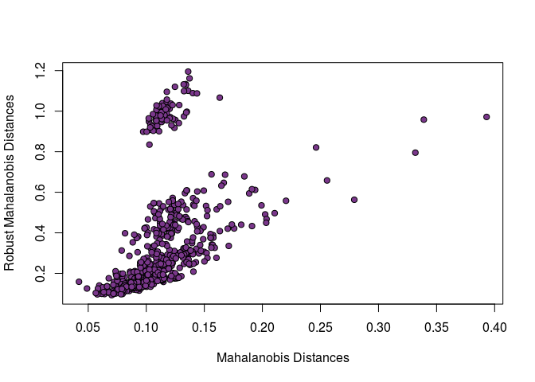
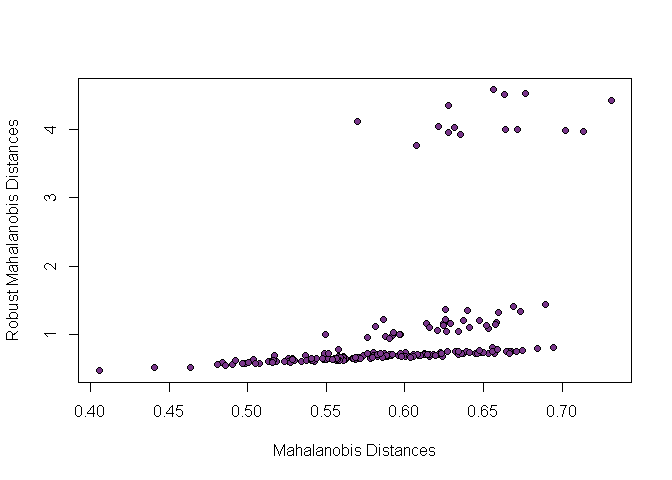
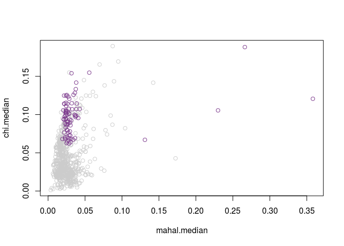
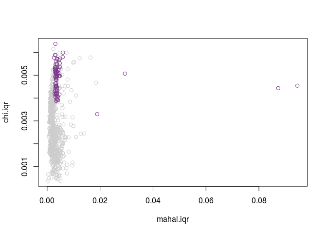
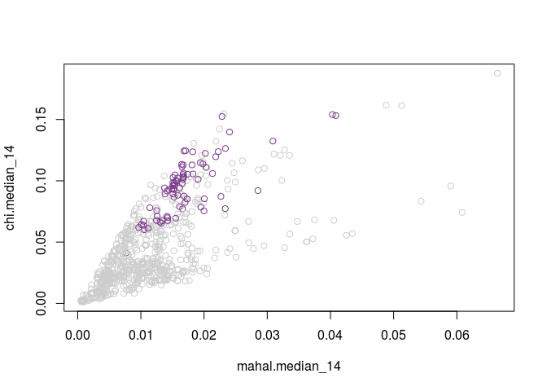

OuRS: Outliers and Robust Structures
================

OuRS
====

`OuRS` is short for *Ou*tliers and *R*obust *S*tructures. The goal of this package is to provide a variety of multivariate outlier detection and robust subspace techniques. While there are several other packages to do so in `R`, this package was developed to meet specific needs not currently met including, for examples, outlier detection in multivariate categorical or mixed data, and simplified approaches to high dimensional (i.e., *n* &lt; &lt;*P*) data.

As of now, the OuRS package is under active development. However, several approaches we make available in `OuRS` are stable and available for use, namely:

-   Minimum covariance determinant (MCD)

-   A generalized MCD ("GenMCD") for almost any data type

-   Principal components analysis + split-half resampling (PCA+SHR)

Installation
------------

Because `OuRS` is under development it is not yet available as a complete package, though it can still be installed. `OuRS` depends on the `GSVD` package ([GSVD](https://github.com/derekbeaton/ExPosition-Family/tree/master/ExPosition2/GSVD)). For now, the simplest approach to installation is through the `devtools` package:

``` r
devtools::install_github("derekbeaton/ExPosition-Family", subdir = "/ExPosition2/GSVD/Package")
devtools::install_github("derekbeaton/OuRS", subdir = "/OuRS")
```

Set up
======

Prior to running the examples, we require several packages to be loaded. The analyses are all performed in `OuRS`, which depends on `GSVD`. We also require `golubEsets` and `cellWise` to access data, and `robustbase` for the `tolEllipsePlot()` function.

Examples
========

Here we provide examples with brief explanations of the three previously mentioned approaches: MCD, GenMCD, and PCA+SHR.

MCD
---

The [MCD algorithm (Hubert & Debruyne, 2009)](https://onlinelibrary.wiley.com/doi/full/10.1002/wics.61) is an outlier detection and robust covariance technique. The MCD's goal is to find a covariance matrix with a robust location (mean) and minimum scatter (covariance). The objective of the MCD is to find a minimum determinant (i.e., product of the eigenvalues), which reflects a minimum scatter. The MCD primarily relies on *subsampling* to find some subsample *H* that provides a minimum determinant. Generally the MCD works as follows. Given some matrix **X** with *I* rows and *J* columns, we randomly subsample **X** to have *H* rows, referred to as **X**<sub>*H*</sub>. The size of *H* is controlled by the user through the *α* parameter which must exist between .5 and 1:

1.  For **X**<sub>*H*</sub>, compute the column-wise mean as **μ**<sub>*H*</sub> and the covariance as **S**<sub>*H*</sub>.

2.  Compute the squared Mahalanobis distances for each observation in **X** as *m*<sub>*i*</sub> = (*x*<sub>*i*</sub> − **μ**<sub>*H*</sub>)**S**<sub>*H*</sub><sup>−1</sup>(*x*<sub>*i*</sub> − **μ**<sub>*H*</sub>)<sup>*T*</sup>.

3.  Set **X**<sub>*H*</sub> as the subset of *H* observations with the smallest Mahalanobis distances computed from Step 2.

4.  Compute and store the determinant of **S**<sub>*H*</sub> which is the covariance matrix of **X**<sub>*H*</sub>.

The steps above are repeated for either a pre-specified number of iterations or until convergence (i.e., the determinant in Step 4 has little to no change). Once completed, the *H* set with a minimum determinant reflects the sub-sample with the robust location (robust mean), minimum scatter (robust covariance) from the data in **X**. Furthermore, a set of robust Mahalanobis distances are computed from the robust covariance matrix. The robust Mahalanobis distances can then be used to identify outliers.

Below we provide an example of the MCD for a routinely used data set for the MCD: the `philips` dataset from the `cellWise` package. While there are numerous outputs from the algorithm, we only show a graph of the standard vs. robust Mahalanobis distances for the `philips` data. The `philips` data are used as a typical example because of the "masking" effect, wherein there are outliers that exist but are not detectable by Mahalanobis distance. This is because they outlyingness of these observations exist, typically, in a lower variance subspace. Thus the MCD and robust Mahalanobis distance "unmasks" these observations.

``` r
data("philips")
# mostly default parameters for now, but with the lowest size
# of H, i.e., alpha=.5, and many iterations
mcd.results <- cont.mcd(philips, alpha = 0.5, num.subsets = 2000)
plot(sqrt(mcd.results$dists$md), sqrt(mcd.results$dists$rob.md), 
    pch = 21, bg = "mediumorchid4", xlab = "Mahalanobis Distances", 
    ylab = "Robust Mahalanobis Distances")
```



As can be seen in the above figure, there are observations with a large robust Mahalanobis distance, but relatively small Mahalanobis distance; these are the observations that were "masked".

GenMCD
------

One of the primary motivations behind the creation of the `OuRS` package was the development of an extension to the MCD. We initially extended the MCD so that it could be applied to categorical (and similar data). However, our extension of the MCD can incorporate data of almost any data type (categorical, ordinal, continuous, counts), either as a homogeneous set or heterogeneous variables (i.e., mixed data).

The example we provide here is strictly categorical data. The data here are a re-coded version of a survey that asked opinions of [different beers brewed in the Dallas-Fort Worth area](http://www.dallasobserver.com/restaurants/dfws-favorite-local-beer-as-proven-by-an-actual-scientist-7024953). Each person's response to each beer is categorized as "LIKE", "DO.NOT.LIKE", or "NO.OPINION".

``` r
load("OuRS/data/dfw.beer.survey.rda")
summary(DFW.beer.survey[, 1:2])
```

    ##          Kolsch        Velvet.Hammer
    ##  DO.NOT.LIKE:107   DO.NOT.LIKE: 26  
    ##  LIKE       : 58   LIKE       :159  
    ##  NO.OPINION : 35   NO.OPINION : 15

``` r
# data are transformed to disjunctive coding:
beer.disj <- make.data.nominal(DFW.beer.survey)
# mostly default parameters for now, but with the lowest size
# of H, i.e., alpha=.5, and many iterations
catmcd.results <- cat.mcd(beer.disj, alpha = 0.5, num.subsets = 2000)
plot(sqrt(catmcd.results$dists$md), sqrt(catmcd.results$dists$rob.md), 
    pch = 21, bg = "mediumorchid4", xlab = "Mahalanobis Distances", 
    ylab = "Robust Mahalanobis Distances")
```



PCA+SHR
-------

The MCD algorithm works only for full (column) rank data with a sufficient ratio of observations to variables (i.e., *n* &gt; *P*). However sometimes data are rank deficient with many more variables than observations (i.e., *n* &lt; *P* or *n* &lt; &lt;*P*). While several options exist for high dimensional data, most are computationally expensive or otherwise restricted in their goals or even what they can estimate. Thus we have [proposed](http://ww2.amstat.org/meetings/jsm/2018/onlineprogram/AbstractDetails.cfm?abstractid=330168), and implemented here, a framework to help identify outliers and make predictive distance estimates regardless of dimensionality. This framework uses principal components analysis (PCA) an split-half resampling (SHR). The PCA+SHR framework allows for us to estimate a variety of distances, as well as identify reproducible and thus robust subspaces (i.e., sets of components).

### PCA

PCA can be expressed as follows. Given some matrix **X** with *I* rows and *J* columns, and assuming that **X** is column-wise centered (and possibly scaled), PCA decomposes **X** into three matrices: **X** = **U****Δ****V**<sup>*T*</sup>, where the observations are represented on the rows of the left singular vectors **U**, or with the component scores as **F**<sub>*I*</sub> = **U****Δ**, which are the columns (components) of the left singular vectors scaled by the singular values (**Δ**). From PCA we can compute two distances:

1.  Squared Mahalanobis distance where **m**<sub>*I*</sub> = diag{**U****U**<sup>*T*</sup>}, and

2.  Squared score distance where **c**<sub>*I*</sub> = diag{**F**<sub>*I*</sub>**F**<sub>*I*</sub><sup>*T*</sup>}.

When data are rank deficient (i.e., *n* &lt; *P* or *n* &lt; &lt;*P*) we cannot compute unique values for **m**<sub>*I*</sub> -- they are all identical. However, if we supplement PCA with SHR, we can compute *predicted* estimates for both **m**<sub>*I*</sub> and **c**<sub>*I*</sub>. With SHR we end up with distributions of predicted values for **m**<sub>*I*</sub> and **c**<sub>*I*</sub>. Furthermore, with SHR, we can keep track of similarity of components between splits over all iterations (i.e., reproducible components). The reproducible components identify a robust subspace.

### Low dimensional example

First we perform PCA+SHR on the `philips` data and compare some of the estimates against the robust Mahalanobis distances from the MCD. While there are many estimates we could make from PCA+SHR, we focus these particular results on the distributions of predicted distances; specifically, we use the inter-quartile range. We use the interval here because large intervals reflect poor predictive estimates.

    ## [1] 0.9846602 0.9871411 0.9847023 0.9778422 0.9101951 0.8755883 0.8994238
    ## [8] 0.9581681 0.9969907


